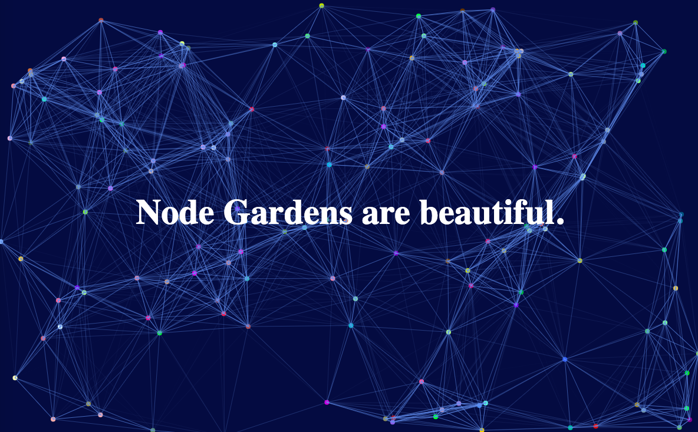

# Node Garden

**Why this project?** I am going to be very honest: node gardens are, in my opinion, very *beautiful* and satisfying to look at. 
A more practical reason is my wish to learn more about js/css/html. The node garden introduced me to the use of classes and having "objects in motion", "appearing" and "disappearing" (in quotes as it is due to a manipulation of their x,y coordinates and the value of their radius/length/...).

The code was relies heavily on a code made by *Marco Biedermann*. As his node garden was not on GitHub, we may consider my repository as a unofficial *fork* from his work. 

**The idea**: playing with his code to understand all the steps (see most of my comments on the js file) and then, modifying it to add a twist. 
Originally Marco's node garden only had black nodes and black edges on a white 'background'. Concerning the little twist, I decided to change these colors and make the color of the each node random (but constant). 

Enjoy! :)

